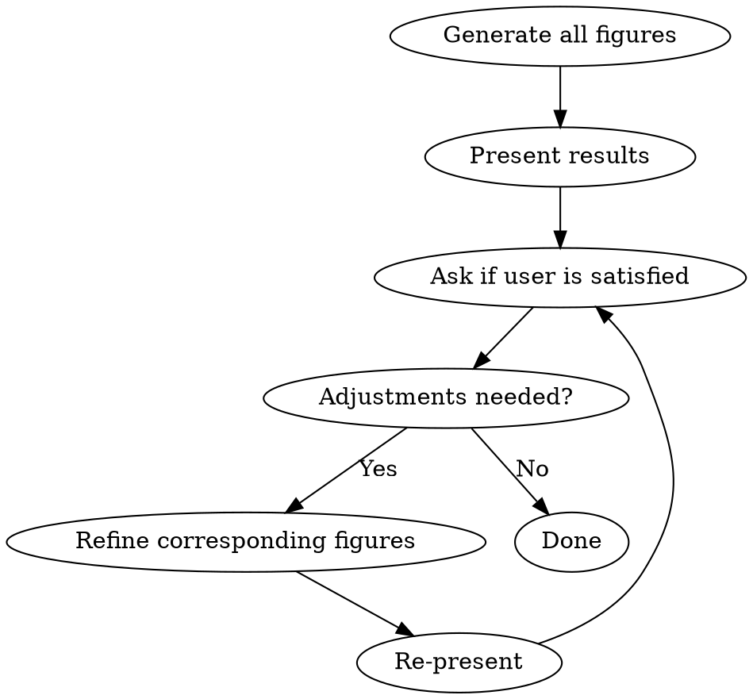

# Scientific Plotting Skill

## Language Rule (MANDATORY)

**Always respond in the user's language.** If the user writes in Chinese, reply in Chinese. If in English, reply in English. This applies to all user-facing text: questions, explanations, confirmations, and error messages.

## Mandatory Pre-Export Format Query

**BEFORE generating any figure code, you MUST ask the user the following questions. Use the user's language when phrasing these questions.**

### Question 1: Output Format

Ask the user: "What format would you like to export the figure in?"
- PNG (raster, suitable for reports/presentations)
- JPG (raster, suitable for reports/presentations)
- SVG (vector, suitable for web/editable graphics)
- PDF (vector, suitable for journal submission/print)
- Other format

### Question 2: Quality Parameters (for raster formats only)

If user selects **PNG** or **JPG**:

Ask: "How would you like to set the quality parameters for the raster format?"
- **Use skill default parameters** (recommended): PNG at DPI=600, JPG at DPI=300
- Custom parameters: specify desired DPI and/or quality settings

**Default parameters for raster formats:**
| Format | DPI | Notes |
|--------|-----|-------|
| PNG | 600 | Suitable for journal submission quality |
| JPG | 300 | Suitable for general reports and presentations |

**Do NOT proceed to generate any code until these questions are answered.**

## Core Rule

**Every figure must start with `setup_journal_style()`**. This function is mandatory and must be called before any plotting code. It locks all rcParams to journal standards automatically.

## Global Style Lock

### `setup_journal_style()`

```python
import matplotlib.pyplot as plt
import matplotlib as mpl
import numpy as np

JOURNAL_COLORS = [
    '#000000', '#E69F00', '#56B4E9', '#009E73',
    '#F0E442', '#0072B2', '#D55E00', '#CC79A7'
]

MONO_COLORS = ['#000000', '#333333', '#666666', '#999999', '#CCCCCC']
MONO_LINESTYLES = ['-', '--', '-.', ':', (0, (3, 1, 1, 1))]
MONO_MARKERS = ['', 'o', 's', '^', 'D']

FIGSIZE = {
    'single': (3.5, 2.5),
    '1.5':    (5.0, 3.5),
    'double': (7.0, 4.5),
}

FONT_FALLBACK = {
    'en': {
        'family': 'serif',
        'serif': ['Latin Modern Roman', 'Computer Modern', 'DejaVu Serif'],
        'math': 'cm',
    },
    'cn': {
        'family': 'serif',
        'serif': ['Latin Modern Roman', 'SimSun', 'Microsoft YaHei', 'DejaVu Serif'],
        'math': 'cm',
    },
    'bilingual': {
        'family': 'serif',
        'serif': ['Latin Modern Roman', 'SimSun', 'WenQuanYi Micro Hei', 'Microsoft YaHei', 'DejaVu Serif'],
        'math': 'cm',
    },
}

def setup_journal_style(
    column='single',
    font='cm',
    lang='en',
    color_mode='color',
    dpi=600,
    grid='light',
    backend='matplotlib',
):
    """
    Mandatory pre-plot style lock for top-tier statistics journals.
    Call this BEFORE creating any figure.

    Parameters
    ----------
    column : str
        'single' (3.5in), '1.5' (5.0in), 'double' (7.0in)
    font : str
        'cm' = Computer Modern (default, matches LaTeX);
        'times' = Times New Roman;
        'latex' = use system LaTeX engine
    lang : str
        'en' | 'cn' | 'bilingual'
    color_mode : str
        'color' = Okabe-Ito palette, grayscale-distinguishable;
        'mono' = pure black/gray with cycling line styles
    dpi : int
        Export resolution. Default 600.
    grid : str
        'light' = dashed light gray; 'none' = no grid
    backend : str
        'matplotlib' | 'seaborn' | 'both'
    """
    fb = FONT_FALLBACK.get(lang, FONT_FALLBACK['en'])

    rc = {
        'figure.dpi': dpi,
        'savefig.dpi': dpi,
        'savefig.bbox': 'tight',
        'savefig.pad_inches': 0.05,
        'figure.figsize': FIGSIZE.get(column, FIGSIZE['single']),

        'font.family': fb['family'],
        'font.serif': fb['serif'],
        'font.size': 8,
        'axes.titlesize': 10,
        'axes.labelsize': 9,
        'xtick.labelsize': 8,
        'ytick.labelsize': 8,
        'legend.fontsize': 8,
        'figure.titlesize': 10,
        'font.weight': 'normal',

        'axes.linewidth': 0.5,
        'xtick.major.width': 0.5,
        'ytick.major.width': 0.5,
        'xtick.minor.width': 0.3,
        'ytick.minor.width': 0.3,
        'xtick.direction': 'in',
        'ytick.direction': 'in',
        'xtick.major.size': 3,
        'ytick.major.size': 3,

        'axes.spines.top': False,
        'axes.spines.right': False,

        'legend.frameon': False,
        'legend.loc': 'upper left',
        'legend.bbox_to_anchor': (1.02, 1),

        'lines.linewidth': 1.2,
        'lines.markersize': 4,
        'lines.markeredgewidth': 0.5,
    }

    if font == 'latex':
        rc['text.usetex'] = True
        rc['text.latex.preamble'] = r'\usepackage{amsmath}'
    else:
        rc['axes.unicode_minus'] = False
        rc['mathtext.fontset'] = fb['math']

    if color_mode == 'color':
        rc['axes.prop_cycle'] = plt.cycler(color=JOURNAL_COLORS)
    else:
        rc['axes.prop_cycle'] = (
            plt.cycler(color=MONO_COLORS) +
            plt.cycler(linestyle=MONO_LINESTYLES) +
            plt.cycler(marker=MONO_MARKERS)
        )

    if grid == 'light':
        rc['axes.grid'] = True
        rc['grid.linewidth'] = 0.3
        rc['grid.linestyle'] = '--'
        rc['grid.alpha'] = 0.4
    else:
        rc['axes.grid'] = False

    plt.rcParams.update(rc)

    if backend in ('seaborn', 'both'):
        import seaborn as sns
        sns.set_theme(
            style='ticks',
            context='paper',
            palette=JOURNAL_COLORS if color_mode == 'color' else MONO_COLORS,
            rc={
                'axes.spines.top': False,
                'axes.spines.right': False,
            }
        )
```

## Component Library

### Matplotlib Components (Fine Control)

Use matplotlib for: envelopes, prediction bands, dual Y-axis, custom annotations, multi-panel layouts.

#### `plot_envelope()`

```python
def plot_envelope(ax, x, mean, error, error_type='sd',
                  color=None, alpha_fill=0.25,
                  label=None, linewidth=1.2):
    """
    Plot mean line with shaded error band.

    error_type : 'sd' | 'sem' | 'ci'
        Automatically labeled in legend if label provided.
    """
    color = color or next(ax._get_lines.prop_cycler)['color']

    ax.fill_between(x, mean - error, mean + error,
                    alpha=alpha_fill, color=color, edgecolor='none')

    suffix = {'sd': ' ± SD', 'sem': ' ± SEM', 'ci': ' (95% CI)'}.get(error_type, '')
    line, = ax.plot(x, mean, color=color, linewidth=linewidth,
                    label=f"{label}{suffix}" if label else None)
    return line
```

#### `plot_prediction_band()`

```python
def plot_prediction_band(ax, x, y_lower, y_upper, y_mid=None,
                         color=None, alpha_band=0.2,
                         label_band='90% PI', label_mid='q50'):
    """
    Plot prediction interval as shaded band with optional median line.
    x can be DatetimeIndex or numeric.
    """
    color = color or next(ax._get_lines.prop_cycler)['color']

    ax.fill_between(x, y_lower, y_upper, alpha=alpha_band,
                    color=color, edgecolor='none', label=label_band)

    line = None
    if y_mid is not None:
        line, = ax.plot(x, y_mid, color=color, linewidth=1.2,
                        linestyle='-', label=label_mid)
    return line
```

#### `create_twin_axis()` + `merge_legends()`

```python
def create_twin_axis(ax_left):
    """
    Create dual Y-axis for combining bar + line plots.
    """
    ax_right = ax_left.twinx()
    ax_right.spines['right'].set_visible(True)
    ax_right.spines['top'].set_visible(False)
    return ax_right

def merge_legends(ax_left, ax_right, loc='upper left', ncol=1):
    """
    Merge legends from both axes. Must be called after all plotting.
    """
    lines_l, labels_l = ax_left.get_legend_handles_labels()
    lines_r, labels_r = ax_right.get_legend_handles_labels()
    ax_left.legend(lines_l + lines_r, labels_l + labels_r,
                   loc=loc, ncol=ncol, frameon=False)
    if ax_right.get_legend():
        ax_right.get_legend().remove()
```

#### `add_metric_text()`

```python
def add_metric_text(ax, metrics_dict, loc='upper right',
                    fontsize=7, separator=' = ', precision=3):
    """
    Annotate statistical metrics inside the plot area.

    metrics_dict : dict
        e.g. {'MAE': 12.34, 'RMSE': 18.56, '$R^2$': 0.947}
    """
    textstr = '\n'.join([
        f"{k}{separator}{v:.{precision}g}" for k, v in metrics_dict.items()
    ])
    props = dict(boxstyle='round,pad=0.3', facecolor='white',
                 edgecolor='gray', alpha=0.9, linewidth=0.5)

    loc_map = {
        'upper right':  (0.98, 0.98, 'top', 'right'),
        'upper left':   (0.02, 0.98, 'top', 'left'),
        'lower right':  (0.98, 0.02, 'bottom', 'right'),
        'lower left':   (0.02, 0.02, 'bottom', 'left'),
    }
    x, y, va, ha = loc_map.get(loc, loc_map['upper right'])

    ax.text(x, y, textstr, transform=ax.transAxes, fontsize=fontsize,
            verticalalignment=va, horizontalalignment=ha, bbox=props)
```

#### `label_subplots()`

```python
def label_subplots(axes, labels=None,
                   x_offset=-0.12, y_offset=1.02,
                   fontsize=10, fontweight='bold'):
    """
    Add A/B/C/D labels to subplots, positioned outside top-left.
    """
    import numpy as np
    axes = np.atleast_1d(axes).flatten()
    if labels is None:
        labels = [chr(65 + i) for i in range(len(axes))]
    for ax, label in zip(axes, labels):
        ax.text(x_offset, y_offset, label, transform=ax.transAxes,
                fontsize=fontsize, fontweight=fontweight, va='top')
```

### Seaborn Components (Statistical Aggregation)

Use seaborn for: boxplots, violin plots, distribution plots, regression scatter, heatmaps.

#### `plot_box_journal()`

```python
def plot_box_journal(ax, data, x, y, hue=None, palette=None,
                     width=0.5, linewidth=0.8, fliersize=3):
    """
    Publication-style boxplot using seaborn.
    """
    import seaborn as sns
    palette = palette or JOURNAL_COLORS

    sns.boxplot(data=data, x=x, y=y, hue=hue, ax=ax,
                palette=palette, width=width, linewidth=linewidth,
                fliersize=fliersize, showcaps=True,
                whiskerprops={'linewidth': linewidth},
                capprops={'linewidth': linewidth},
                medianprops={'color': 'black', 'linewidth': 1.2})

    ax.spines['top'].set_visible(False)
    ax.spines['right'].set_visible(False)
```

#### `plot_distribution_journal()`

```python
def plot_distribution_journal(ax, data, bins='auto', kde=True,
                              color=None, hist_alpha=0.4,
                              kde_linewidth=1.2):
    """
    Histogram + KDE with journal styling.
    """
    import seaborn as sns
    color = color or JOURNAL_COLORS[0]

    sns.histplot(data=data, bins=bins, kde=kde, ax=ax,
                 color=color, alpha=hist_alpha,
                 edgecolor='white', linewidth=0.5,
                 line_kws={'linewidth': kde_linewidth, 'color': color})

    ax.spines['top'].set_visible(False)
    ax.spines['right'].set_visible(False)
```

#### `plot_heatmap_journal()`

```python
def plot_heatmap_journal(ax, data, annot=True, fmt='.2f',
                         cmap='RdBu_r', center=0,
                         cbar_kws=None):
    """
    Journal-style heatmap. Default diverging colormap centered at 0.
    """
    import seaborn as sns
    cbar_kws = cbar_kws or {'shrink': 0.8, 'label': ''}

    sns.heatmap(data, ax=ax, annot=annot, fmt=fmt,
                cmap=cmap, center=center,
                linewidths=0.5, linecolor='white',
                cbar_kws=cbar_kws, square=True)

    for spine in ax.spines.values():
        spine.set_visible(False)
```

## Natural Language to Code Generation

When the user describes a figure in natural language, follow this parsing pipeline:

### Step 1: Extract Metadata
- Figure number (e.g., "图2-4") → use in filename / comments
- Title → code header comment
- Purpose → informs emphasis (dispersion vs comparison vs trend)

### Step 2: Identify Skeleton

| User Keywords | Skeleton |
|---------------|----------|
| "双Y轴", "左侧...右侧...", "柱状图+折线图" | Dual-axis: `create_twin_axis()` + `merge_legends()` |
| "多面板", "子图", "A/B/C" | Multi-panel: `plt.subplots()` + `label_subplots()` |
| "对比", "vs", "不同方法" | Grouped comparison: `hue` or facets |
| "时序", "时间", "日期" | Time series: datetime index + formatter. **ALWAYS sparse tick labels** — see Rule 1 above |

### Step 3: Identify Data Relationship
- "槽位 0-95", "96个时段" → discrete x-axis, custom `xticks`
- "2024-10-11 至 2024-10-17" → `df.loc[start:end]` crop
- "测试集", "训练集" → prompt user for data split or use placeholder
- "代表性时段" → add comment for user confirmation

### Step 4: Identify Overlay Elements

| User Keywords | Component |
|---------------|-----------|
| "均值±标准差", "包络", "类内离散度" | `plot_envelope(error_type='sd')` |
| "均值±标准误", "SEM" | `plot_envelope(error_type='sem')` |
| "置信区间", "95% CI" | `plot_envelope(error_type='ci')` or `stats.t.interval` |
| "q10/q90", "预测区间", "阴影", "覆盖效果" | `plot_prediction_band()` |
| "MAE", "RMSE", "轮廓系数", "一致率", "$R^2$" | `add_metric_text()` |
| "聚类标签", "标注" | `ax.text()` or `ax.annotate()` with arrows |

### Step 5: Identify Style Constraints
- "叠加展示" → set explicit `zorder` for layers
- "图例" → merge if dual-axis, place outside if crowded (`bbox_to_anchor`)
- "标注...互补定位", "箭头" → `ax.annotate()` with `arrowprops`
- "截取", "特定时段" → data preprocessing before plotting

### Step 6: Generate Code Structure

Every generated script MUST follow this structure:

```python
# ============================================
# <Figure Number> <Title>
# Purpose: <purpose>
# ============================================

import numpy as np
import pandas as pd
import matplotlib.pyplot as plt
import seaborn as sns

# Step 0: Global style lock (MANDATORY)
setup_journal_style(column='single', font='cm', lang='bilingual',
                    color_mode='color', backend='both')

# Step 1: Data preparation
# TODO: replace with actual data
# df = pd.read_csv('your_data.csv')

# Step 2: Plotting
fig, ax = plt.subplots()
# ... compose components based on parsing ...

# Step 3: Annotation and formatting
# ax.set_xlabel('...')
# ax.set_ylabel('...')
# add_metric_text(ax, {...})

# Step 4: Export (use format and DPI from user's pre-export query)
# Example for PNG: fig.savefig('<fig_number>.png', format='png', dpi=600, ...)
# Example for PDF: fig.savefig('<fig_number>.pdf', format='pdf', dpi=600, ...)
plt.show()
```

## Complete Examples

### Example 1: Cluster Day-Load Envelopes

```python
# ============================================
# 图2-4 日曲线聚类结果可视化
# Purpose: 展示类内离散度与类间分离度
# ============================================

import numpy as np
import pandas as pd
import matplotlib.pyplot as plt

setup_journal_style(column='single', font='cm', lang='bilingual',
                    color_mode='color', backend='both')

# Data placeholder
# df = pd.read_csv('cluster_data.csv')
# Expected columns: slot (0-95), load, cluster

fig, ax = plt.subplots()

for cid in df['cluster'].unique():
    sub = df[df['cluster'] == cid]
    mean = sub.groupby('slot')['load'].mean()
    std = sub.groupby('slot')['load'].std()
    slots = mean.index

    plot_envelope(ax, slots, mean.values, std.values,
                  error_type='sd', label=f'Cluster {cid}')

ax.set_xlabel('Slot (0-95)')
ax.set_ylabel('Load (MW)')
ax.set_xticks(range(0, 96, 12))

add_metric_text(ax, {'Silhouette': 0.72, 'Consistency': 0.89},
                loc='upper right')

ax.legend(loc='upper left', frameon=False)
# Export: use format and DPI from user's pre-export query
plt.show()
```

### Example 2: QGAM Prediction with Quantile Bands

```python
# ============================================
# 图3-1 QGAM q50预测效果图
# Purpose: 展示概率预测的覆盖效果
# ============================================

import pandas as pd
import matplotlib.pyplot as plt

setup_journal_style(column='single', font='cm', lang='bilingual',
                    color_mode='color', backend='both')

# Data placeholder
# df = pd.read_csv('qgam_results.csv')
# Expected columns: timestamp, actual, q10, q50, q90

# Crop to representative period
df_sub = df.loc['2024-10-11':'2024-10-17']

fig, ax = plt.subplots()

ax.plot(df_sub.index, df_sub['actual'], color='#000000',
        linewidth=1.0, label='Actual', zorder=3)

plot_prediction_band(ax, df_sub.index,
                     df_sub['q10'], df_sub['q90'],
                     y_mid=df_sub['q50'],
                     color='#56B4E9',
                     label_band='90% PI', label_mid='q50')

ax.set_xlabel('Time')
ax.set_ylabel('Load (MW)')
ax.legend(loc='upper left', frameon=False)
fig.autofmt_xdate(rotation=15)

# Export: use format and DPI from user's pre-export query
plt.show()
```

### Example 3: Dual-Axis Model Comparison

```python
# ============================================
# 图3-2 QGAM vs XGBoost预测精度与不确定性对比
# Purpose: 展示两者的互补定位
# ============================================

import numpy as np
import pandas as pd
import matplotlib.pyplot as plt

setup_journal_style(column='single', font='cm', lang='bilingual',
                    color_mode='color', backend='both')

# Data placeholder
metrics = pd.DataFrame({
    'metric': ['MAE', 'RMSE'],
    'QGAM': [12.3, 18.5],
    'XGBoost': [10.1, 15.2],
})

fig, ax_left = plt.subplots()
ax_right = create_twin_axis(ax_left)

x = np.arange(len(metrics))
width = 0.35

bars1 = ax_left.bar(x - width/2, metrics['QGAM'], width,
                    label='QGAM', color=JOURNAL_COLORS[1],
                    edgecolor='black', linewidth=0.5)
bars2 = ax_left.bar(x + width/2, metrics['XGBoost'], width,
                    label='XGBoost', color=JOURNAL_COLORS[2],
                    edgecolor='black', linewidth=0.5)

ax_left.set_ylabel('Error (MW)')
ax_left.set_xticks(x)
ax_left.set_xticklabels(metrics['metric'])

# Right axis: interval width (example values)
ax_right.plot(x, [8.5, 8.5], 'o-', color=JOURNAL_COLORS[3],
              label='QGAM Interval Width', linewidth=1.2)
ax_right.set_ylabel('Interval Width (MW)', color=JOURNAL_COLORS[3])
ax_right.tick_params(axis='y', labelcolor=JOURNAL_COLORS[3])

merge_legends(ax_left, ax_right, loc='upper center', ncol=2)

# Annotation positioned in blank area, not blocking data or axes
ax_left.annotate('QGAM: better uncertainty\nXGBoost: better point estimate',
                 xy=(0.85, 0.75), xycoords='axes fraction',
                 ha='center', fontsize=7, va='top',
                 bbox=dict(boxstyle='round,pad=0.3', facecolor='white', alpha=0.8))

# Export: use format and DPI from user's pre-export query
plt.show()
```

## Multi-Panel Layouts

```python
fig, axes = plt.subplots(1, 3, figsize=FIGSIZE['double'])
fig.subplots_adjust(wspace=0.35, left=0.08, right=0.98,
                    top=0.92, bottom=0.18)

# ... plot on axes[0], axes[1], axes[2] ...

label_subplots(axes, labels=['A', 'B', 'C'])

for ax in axes:
    ax.set_xlabel(ax.get_xlabel())
    ax.set_ylabel(ax.get_ylabel())

# Export: use format and DPI from user's pre-export query
plt.show()
```

## Export Settings

**Use the format and quality parameters specified by the user in the pre-export query.** The format is no longer restricted to PDF.

```python
# For raster formats (PNG, JPG): use user-specified DPI
fig.savefig('figure.png', format='png', dpi=600,
            bbox_inches='tight', facecolor='white')
fig.savefig('figure.jpg', format='jpg', dpi=300,
            bbox_inches='tight', quality=95)

# For vector formats (PDF, SVG): use DPI=600 for compatibility
fig.savefig('figure.pdf', format='pdf', dpi=600,
            bbox_inches='tight', pad_inches=0.05)
fig.savefig('figure.svg', format='svg', bbox_inches='tight')
```

## Axis Tick Formatting Rules

### Rule 1: Sparse Tick Labels for Large Time Series

**When data volume is large (e.g., 100+ points on x-axis), NEVER display every point's label.**

| Data Points | Max Tick Labels |
|-------------|------------------|
| 50–100 | Show every 5th or 10th |
| 100–365 | Show every 20th–30th |
| 365+ | Show every 30th–60th |

```python
# Example: 365 dates → show every 30th
n = len(df)
step = n // 12  # ~12 labels total
ax.set_xticks(df.index[::step])
ax.set_xticklabels([d.strftime('%m-%d') for d in df.index[::step]], rotation=30)
```

**Forbidden:** Adding labels like `df.index[::1]` or `range(0, 365)` that shows all points.

### Rule 2: Reduce Font Size for Long Labels

**When axis tick labels exceed ~15 characters (e.g., "yyyy-mm-dd hh:mm:ss"), reduce font size.**

```python
# Long datetime labels → smaller font
if len(ax.get_xticklabels()[0].get_text()) > 15:
    ax.tick_params(axis='x', labelsize=6)

# General guideline: if labels crowd or overlap, reduce by 1–2 pt
# from the default (8pt for xtick, 8pt for ytick)
```

**Principle:** The figure is the visual focus. Long labels should be subordinate, not dominant.

---

## Legend Positioning Rule

Legend position should be chosen flexibly based on plot layout and data distribution, prioritizing positions that do not cover data.

**Decision flow:**
1. Evaluate whether the plot interior has sufficient blank space
2. If interior space is available, place legend inside (`upper right`, `upper left`)
3. If data is dense or space is limited, move legend outside (`bbox_to_anchor`)
4. For many legend items, use `ncol` for multi-column layout or reduce font size

```python
# ✅ Case 1: Space on right side → legend outside right
ax.legend(loc='upper left', bbox_to_anchor=(1.02, 1))

# ✅ Case 2: Space above → legend at top center
ax.legend(loc='upper center', ncol=3)

# ✅ Case 3: Upper left is blank → legend at upper left
ax.legend(loc='upper left')

# ✅ Case 4: Many items → multi-column
ax.legend(loc='upper left', bbox_to_anchor=(1.02, 1), ncol=2, fontsize=7)
```

**Smart defaults by plot type:**
- **Distribution/density plots (KDE, histogram, violin)**: Upper right corner is typically blank → prefer `loc='upper right'`
- **Time series with data near edges**: Consider `loc='upper left'` or external placement
- **Bar charts**: Often space above bars → `loc='upper center'` with `ncol`

**Using `loc='best'`:** When positioning is ambiguous and cannot be confidently determined, `loc='best'` is acceptable. The user feedback step will catch any poor placements.

---

## Annotation & Mark Positioning Rule

**Do not use marks (text, arrows, etc.) to cover the plot, axes, or title.**

**Decision flow:**
```
Before adding mark → Check necessity → Check space → Won't cover anything → Then add
```

**Principles:**
- Avoid marks unless necessary
- Marks should be at plot edges, not in data-dense regions
- Arrows only for pointing to data features; must not cross data points
- Text labels only when no other way to convey information

```python
# ✅ Correct: mark in blank area, not covering data
ax.annotate('peak', xy=(10, 5), xytext=(12, 5.5),
            arrowprops=dict(arrowstyle='->', color='gray', lw=0.5))

# ❌ Forbidden: mark covering axes, title, or data-dense region
ax.annotate('peak', xy=(0.1, 0.95), xycoords='axes fraction')  # covers title
ax.text(50, 2.5, 'anomaly', ha='center')  # in the middle of data points
```

**Checklist:**
- [ ] Mark not near axis tick marks
- [ ] Mark not near title or axis labels
- [ ] Mark not in the most data-dense region
- [ ] Arrow does not cross any data points

---

## Pre-Export Checklist

Verify before declaring any figure complete:

- [ ] `setup_journal_style()` called before any plotting
- [ ] Font: serif (Computer Modern preferred), 8–10 pt
- [ ] Spines: top and right removed; ticks inward
- [ ] Colors: distinguishable in grayscale when `color_mode='color'`
- [ ] Error bands: type explicitly labeled (SD / SEM / 95% CI)
- [ ] Axis labels: include units, no bold weight
- [ ] Legend: frameless; **positioned to not cover data** (outside or in blank area)
- [ ] Subplot labels: A/B/C/D, bold, positioned outside top-left
- [ ] Export: format and DPI as specified by user, `bbox_inches='tight'`
- [ ] Minus signs: render correctly for chosen `font` and `lang`
- [ ] **No annotations/marks covering data, axes, or title**
- [ ] Figure size matches target journal column width
- [ ] **Large time series: tick labels sparse, not every point**
- [ ] **Long axis labels (15+ chars): reduced font size (6–7 pt)**

## Post-Generation User Feedback Flow

When the user requests multiple figures, follow this workflow:

### Step 1: Generate All Figures

Generate and export all figures as requested. Ensure each figure passes the full Pre-Export Checklist.

### Step 2: Present Results

Display the completed figures to the user.

### Step 3: Ask for Adjustments

**Must ask the user (in their language):**

> "All figures have been generated. Are you satisfied with the display of each figure? If any figure needs individual adjustments (such as colors, annotation positions, legend, font size, axis ranges, etc.), please let me know which specific figures need changes and what adjustments are needed."

### Step 4: Refine Based on Feedback

If the user identifies figures needing adjustment:

1. **Process one by one**: Modify code for each figure the user specified
2. **Targeted changes**: Only adjust the issues mentioned; do not change other parts
3. **Re-present**: Show the modified figure and confirm the adjustment effect
4. **Loop**: Repeat Step 3 and Step 4 until the user is satisfied

### Flowchart



---

## Other Packages

### plotnine (Python ggplot2)

If the user prefers ggplot2-style syntax, `setup_journal_style()` still applies because plotnine renders via matplotlib. Use the R `theme_publish` settings from the original skill as a reference for manual plotnine theming.

### arviz (Bayesian visualization)

arviz plots inherit matplotlib rcParams automatically. Call `setup_journal_style()` before any arviz plotting function (e.g., `az.plot_posterior()`, `az.plot_forest()`).

## Common Mistakes to Avoid

| Mistake | Fix |
|---------|-----|
| Times New Roman too bold | Use regular weight, not bold; prefer Computer Modern |
| Too many colors | Use monochrome or 2–3 colors maximum |
| Missing uncertainty visualization | Always include SD, SEM, or CI bands |
| Grid lines too prominent | Keep alpha ≤ 0.4, linewidth ≤ 0.3 |
| Legend overlapping data | Position flexibly based on available space; use `bbox_to_anchor` when needed |
| Inconsistent axis limits across panels | Set identical `xlim` / `ylim` for comparison plots |
| Using `text.usetex=True` without LaTeX installed | Fallback to `font='cm'` with mathtext |
| Chinese minus signs as blocks | `axes.unicode_minus=False` (set automatically) |
| **Dense time series with all labels** | Use `set_xticks(data[::step])` — never show every point |
| **Full datetime strings like "2024-10-11 08:00"** | Truncate to short form or use `labelsize=6` |
| **Annotations covering axes/title/data** | Check position before adding; prefer edge placement |
